### Seja bem-vindo! 👋

Me chamo Enrico Gollner, tenho 4 anos trabalhando como desenvolvedor de software e adquirindo experiência em desenvolvimento web (React, Java, Spring e um pouco de .NET) e mobile (Flutter). 
Atualmente estou cursando a pós-graduação de "Software Architecture" da FIAP e participando do treinamento "Descomplicando AWS 2026" da LinuxTips para aprimorar meus conhecimentos em Cloud.

   <h2 align="center">🛠 Technologies</h2>
  

   
  <code></code>  
  <code></code>  
  

   
   

 

  <strong>📧 Social Network:</strong> ⤵️
  
 
     
 

